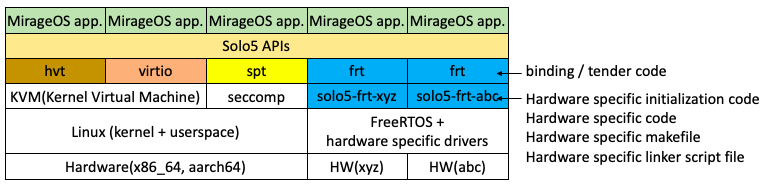

# Solo5-embedded

This repository includes information about Solo5/MirageOS porting to microcontrollers(MCUs).

## Design overview

- A new binding/tender named 'frt' running on top of FreeRTOS and hardware specific drivers is implemented.
- An additional package named 'solo5-frt-xyz' for the hardware xyz is newly introduced. This package holds hardware specific files.
- Changing a target hardware type can be done in a similar manner to [conf-llvm](https://github.com/ocaml/opam-repository/tree/master/packages/conf-llvm).

## Design details

- See [the design document](./docs/DESIGN.md). You can find the current status of this porting.

## Porting to other MCUs

- A document will become available soon!
