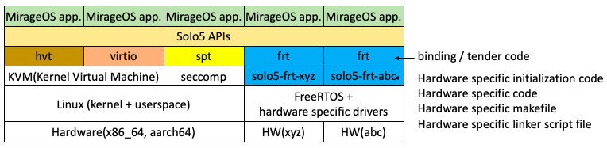

# Solo5 frt binding/tender

## Design

### Approach

- FreeRTOS based (binding/tender as FreeRTOS tasks)
- Taking advantage of device drivers and libraries provided by processor vendors as possible
- Unified interfaces for a variety of processors
- Supporting MirageOS unikernels (native code) 

### Software components

New binding and tender named 'frt' were experimentally added in the Solo5 package [1]. They does not have any processor specific component. 

Processor specific components are included in a newly introduced package named 'solo5-frt-xyz' ('xyz' means a target processor name). You can select a target processor easily by invoking just one command. Components in the package should be designed to call functions or handlers in FreeRTOS, processor specific drivers and libraries provided by a processor vendor.  

Major processor vendors often provide FreeRTOS configured for their  processors. 'solo5-frt-xyz' are expected to use it.



[1] https://github.com/TImada/solo5/tree/frt

### Main execution sequence

The Solo5 frt tender and binding are invoked from a FreeRTOS task named 'solo5_main'. The other task named 'idle' is [an idle task](https://www.freertos.org/RTOS-idle-task.html) automatically created when the FreeRTOS scheduler is invoked.


### Solo5 frt interfaces and macros

Implementation example can be found in [platform_am64x_binding.h](https://github.com/TImada/solo5-frt-am64x-r5/blob/main/platform_am64x_binding.h) and [platform_am64x_tender.h](https://github.com/TImada/solo5-frt-am64x-r5/blob/main/platform_am64x_tender.h).

```c
(binding)

/* CPU initialization after the FreeRTOS task invocation */
void platform_cpu_init(void);

/* Timer initialization after the FreeRTOS task invocation */
void platform_timer_init(void);

/* Console initialization after the FreeRTOS task invocation */
void platform_console_init(void);

/* Block device initialization after the FreeRTOS task invocation */
void platform_block_init(void);

/* Network device initialization after the FreeRTOS task invocation */
void platform_net_init(void);

/* Console puts */
int platform_puts(const char *buf, int n);
```

```c
(tender)

/* Macros for the console */
/* PLATFORM_PRINTF : platform specific printf function
 * PLATFORM_PERROR : platform specific printf function with error consideration
 */
#define PLATFORM_PRINTF (XXX)
#define PLATFORM_PERROR (YYY)

/* Early platform initialization before the FreeRTOS task invocation */
void early_platform_init(void);

/* Get the current timer count count value on a target processor */
uint64_t platform_get_timer_count(void);

/* Timer count adjustment for specialized timer count handling.
 * Just returning `tc` without any modification is enough in many cases.
 */
uint64_t platform_adjusted_tcount(uint64_t tc);
```

## Package installation

### General installation procedure

Package installation can be quite simple if a `solo5-frt-xyz` package and a `conf-frt.xyz` package (meaning `conf-frt` package version `xyz`) are provided.

Intallation of the `solo5-frt` and `ocaml-solo5-cross-frt` packages below can be omitted if package dependency is properly defined.

```shell
# Add an additional repository for MCUs to opam (repository name: "embedded")
$ opam repo add embedded https://github.com/TImada/mirage-embedded-repo
$ opam update

# Install the mirage package
$ opam install mirage

# Install the solo5-frt-xyz package for your target processor (target processor: "xyz")
$ opam install solo5-frt-xyz

# Install the Solo5 frt configuration package to select the processor "xyz" as a target processor for the Solo5 frt
$ opam install conf-frt.xyz

# Install the solo5-frt package, Solo5 implementation with the frt binding/tender
$ opam install solo5-frt

# Install the ocaml-solo5-cross-frt package, ocaml-solo5 implementation supporting the Solo5 frt
$ opam install ocaml-solo5-cross-frt

# Configure MirageOS to use the Solo5 frt (we assume that the hello world console sample is our target)
$ cd /path/to/mirage-skeleton/device-usage/console
$ mirage configure -t frt

# Build the target unikernel
$ make
```

You can check what is happening on installation of Solo5 frt related packages.


### OCaml compiler  
The original OCaml compiler does not suppport processor embedded processor architecture such as Arm(r) Cortex(r)-R/M series.

Currently, modified OCaml compiler implementation supporting Arm(r) Cortex(r)-R5F is experimentally provided. This package is installed automatically during the `ocaml-solo5-cross-frt` installation step.

```
OCaml base version               : 4.14.1
Source package name in opam      : ocaml-embedded-src
Supported processor architecture : Arm(r) Cortex(r)-R5F with VFPv3-D16
                                 : Arm(r) Cortex(r)-M7 with VFPv5-D16
```

You can find the source code repository at [here](https://github.com/TImada/ocaml/tree/embedded).

## Solo5 frt implementation 

### OS Time management  
Time management in the Solo5 frt depends on the tick count in FreeRTOS. Each tick interval is assumed to be 1[ms]. Therefore, the Solo5 frt can provide OS time control in the order of milliseconds at most.

### Stack and heap regions

- Stack  
  - Solo5(MirageOS) and FreeRTOS share a same stack space defined as a FreeRTOS task stack space

- Heap  
  - Solo5(MirageOS) uses a dedicated heap space
  - FreeRTOS does not use any heap space

### FreeRTOS specific configuration

The current implementation of the Solo5 frt binding/tender does not use dynamic memory management implemented in FreeRTOS. Therefore, `heap_*.c` in FreeRTOS is not required now.

<u>Note that this configuration may be changed in future depending on additional implementation of a new event handler.</u>

### Output binary

One ELF binary named "`${application_name}.frt`" is generated. This file includes what is required to run on top of a target processor without any other file.

## Current status

### Supported processor cores

- Arm(r) Cortex(r)-R5F in TI AM64x series (Package '[solo5-frt-am64x-r5](https://github.com/TImada/solo5-frt-am64x-r5)')
- Arm(r) Cortex(r)-M7 in i.MX RT1176 (Package '[solo5-frt-rt1176-m7](https://github.com/TImada/solo5-frt-rt1176-m7)')

### Supported peripheral devices

- Debug console
- Wired networking device
