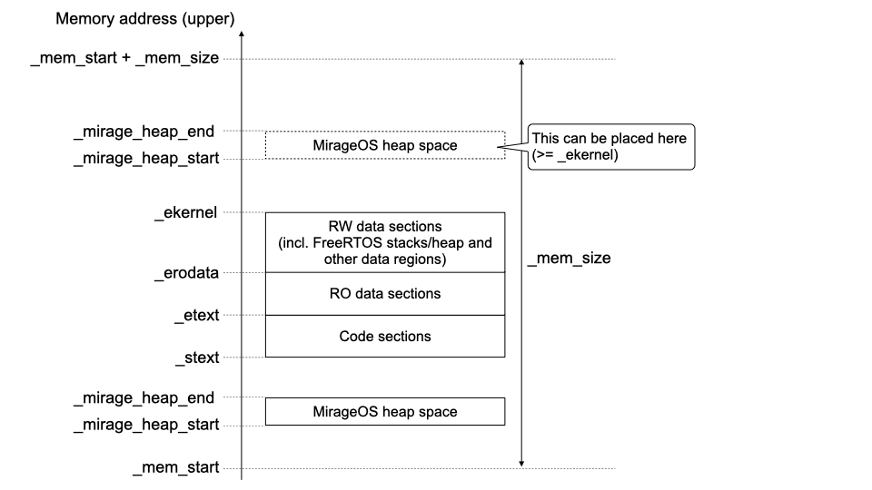

# Solo5 frt porting to other MCUs

**(Currently, this document focuses on only MCUs with Arm(r) processor architecture such as ARMv7-M, ARMv8-M or ARMv7-R)**

If you want to have Solo5 frt porting to a processor named 'xyz', topics below must be followed:

1. Porting an OCaml compiler to target processor architecture
2. Providing a `solo5-frt-xyz` package
4. Adding the version `xyz` to the `conf-frt` package
5. Adding processor architecture files to the `solo5-frt` package
6. Adding processor specific PMU functions to the `solo5-frt` package
7. Adding a target processor to the `ocaml-solo5-cross-frt` package

## 1. Porting an OCaml compiler to target processor architecture

Original OCaml compilers does not support any MCU. Therefore, you must add support for your target processor architecture.

The [embedded branch](https://github.com/TImada/ocaml/tree/embedded) now experimentally supports the ARMv7-R processor architecture with VFPv3-D16. This additional implementation includes addditional codes for freestanding. For other processor architecture, adding processor architetcure parts like [this](https://github.com/TImada/ocaml/commit/3e32a3bcd0a645eae329d5375eef142f8abfc7af#diff-7647a1f5d282d1dbee1f6bbfed76fdba9127a1d5280af74e8f91ffaea2e95a2b) in `runtime/arm.S` would be enough.

You must define a new value for the `-target=` configuration option if you add a new processor architecture support. This value is used in the `conf-frt` package. (For the support of the ARMv7-R processor architecture above, a value `armv7r-freestanding-eabihf` for the option was defined)

## 2. Providing a FreeRTOS kernel

MCU vendors often their own FreeRTOS porting for their MCUs. The easiest way to provide a FreeRTOS kernel for your target MCU is to use a kernel provided by a MCU vendor.

In any cases, you must have a FreeRTOS kernel with the follwing configuration.

- heap_4.c is used as a dynamic memory allocation scheme.
  - `configSUPPORT_DYNAMIC_ALLOCATION` and `configAPPLICATION_ALLOCATED_HEAP` must be enabled
  - `configTOTAL_HEAP_SIZE` must be set with enough size

## 3. Providing a solo5-frt-xyz package

This package have functionality to provide required files for a target processor. You must at least implement functionality to copy required files. Building a library during installation of this package can be optional.

### Required files

This package must include at least the following files below.  
(You can check [solo5-frt-am64x-r5](https://github.com/TImada/solo5-frt-am64x-r5) as sample implementation)

#### Makefile.soc

This file is addtitionally used in building the `solo5-frt`, `ocaml-solo5-cross-frt` and other pakcages.

You should define several variables below.  
(Some variables can be ignored depending on your target processor)

```
$(MARCH)			 : Processor architecture (specify the same as in the -march option for GCC)
$(PROC_FAMILY)		 : Processor family (currently `ARM_CV7R` for ARM Cortex-R4/R5/R7/R8 and `ARM_CV7M_DWT` for ARM Cortex-M4/M7 with DWT are supported)
$(CFLAGS_SOC)        : CFLAGS used for compiling frt binding codes
$(HOSTCFLAGS_SOC)    : CFLAGS used for compiling frt tender codes
$(frt_soc_SRCS)      : Additonal source files compiled in the frt tender side
$(CPPFLAGS_SOC)      : Additional header file paths for the frt binding side
$(HOSTCPPFLAGS_SOC)  : Additional header file paths for the frt tender side
$(LD_FILE)           : Linker file path with its absolute path
#(LIBS_PATH)         : Library paths for linking
$(LIBS)              : Library names to be searched for linking
$(LD_LFLAGS)         : Link flags for the linker
$(CC_LFLAGS)         : Link flags for the compiler
```

#### platform_binding.h / platform_tender.h

These files must define the Solo5 frt interfaces below. You will have to  implement the interfaces in other files unless you define them as inline functions in `platform_binding.h` and `platform_tender.h`.

```c
(platform_binding.h)

/* CPU initialization after the FreeRTOS task invocation */
void platform_cpu_init(void);

/* Timer initialization after the FreeRTOS task invocation */
void platform_timer_init(void);

/* Console initialization after the FreeRTOS task invocation */
void platform_console_init(void);

/* Block device initialization after the FreeRTOS task invocation */
void platform_block_init(void);

/* Network device initialization after the FreeRTOS task invocation */
void platform_net_init(void);

/* Console puts */
int platform_puts(const char *buf, int n);
```

```c
(platform_tender.h)

/* Base task priority for MirageOS related tasks */
/* This priority value is used in frt_startup.c.
 * #define MIRAGE_TASK_PRI     (MIRAGE_BASE_PRI)
 * #define BACKEND_TASK_PRI    (MIRAGE_TASK_PRI - 1)
 */
#define MIRAGE_BASE_PRI (5) 

/* Macros for the console */
/* PLATFORM_PRINTF : platform specific printf function
 * PLATFORM_PERROR : platform specific printf function with error consideration
 */
#define PLATFORM_PRINTF (XXX)
#define PLATFORM_PERROR (YYY)

/* Macros for networking */
/* Define LWIP_INPUT_TASK or LWIP_INPUT_ISR.
 * LWIP_INPUT_TASK : LWIP processing for a taregt processor is done in 
 *                   a FreeRTOS task
 * LWIP_INPUT_ISR  : LWIP processing for a taregt processor is done in 
 *                   an ISR (interrupt service routine)
 */
#define LWIP_INPUT_TASK
//#define LWIP_INPUT_ISR

/* LWIP_NETIF_INIT represents an initialization handler usually invoked
 * for the original netif_add function.
 * This handler varies depending on a target processor.
 */
#define LWIP_NETIF_INIT xxxx_init

/* Early platform initialization before FreeRTOS becomes ready */
void early_platform_init_1(void);
/* Early platform initialization after FreeRTOS became ready */
void early_platform_init_2(void);

/* Get the current timer count count value on a target processor */
uint64_t platform_get_timer_count(void);

/* Timer count adjustment for specialized timer count handling.
 * Just returning `tc` without any modification is enough in many cases.
 */
uint64_t platform_adjusted_tcount(uint64_t tc);
```

#### solo5_frt.lds

This is a linker script file for a target processor. You must define a independent heap space dedicated to MirageOS like an example below.

```
MIRAGE_HEAP_SIZE (0x80000000)
...
...
    .mirage_heap (NOLOAD) : {
        _mirage_heap_start = .;
        . = . + MIRAGE_HEAP_SIZE;
        _mirage_heap_end = .;
    }
```

Current implementation expects that the memory map is configured as illustrated in the figure below.



In addition, the linker script file must define several variables.

```c
_mem_start  /* Start address of the whole memory space allocated to this MirageOS application */
_mem_size   /* The whole memory size */

_mirage_heap_start /* Start of the heap space dedicated to MirageOS */
_mirage_heap_end   /* Upper bound of the heap space dedicated to MirageOS */

_stext      /* Start address of the code sections */
_etext      /* Upper bound of the code sections (= start address of the RO data sections) */
_erodata    /* Upper bound of the RO data sections (= start address of the RW data sections) */
_ekernel    /* Upper bound of the RW data sections */
```

#### FreeRTOSConfig.h

This file is a configuration file for FreeRTOS and it must be created based on `FreeRTOSConfig.h` provided by a processor vendor.

Several C macros below must be defined properly.

```c
#define configUSE_PREEMPTION                    (1) /* must be 1 */
#define configUSE_TICKLESS_IDLE                 (0) /* must be 0 */
#define configUSE_TICK_HOOK                     (0) /* must be 0 */
#define configCPU_CLOCK_HZ                      (800000000) /* must be set */
#define configSYSTICK_CLOCK_HZ                  (25000000) /* must be set */
#define configTICK_RATE_HZ                      (1000) /* must be 1000 */
#define configMAX_PRIORITIES                    (16) /* must be larger than or equal to 2 */
#define configUSE_16_BIT_TICKS                  (0) /* must be 0 */
#define configUSE_TASK_NOTIFICATIONS            (1) /* must be 1 */
...
```

### File installation

Files in this packages required to build the `solo5-frt`, `ocaml-solo5-cross-frt` and other Solo5/MirageOS/Ocaml packages must be installed under `${HOME}/solo5-frt-xyz`.

For reference, see the [install.sh](https://github.com/TImada/solo5-frt-am64x-r5/blob/main/install.sh) file designed for `am64x-r5`.

## 3. Adding the version 'xyz' to the conf-frt package

You must add `conf-frt.xyz` to the [conf-frt](https://github.com/TImada/mirage-embedded-repo/tree/main/packages/conf-frt) package. It must have the same directory structure as that for [am64x-r5](https://github.com/TImada/mirage-embedded-repo/tree/main/packages/conf-frt/conf-frt.am64x-r5).

The `conf-frt.config` file must have the `ocaml-target`, `soc` and `cross-prefix` variables.

```
(conf-frt.config example)

ocaml-target: "armv7r-freestanding-eabihf"
soc: "am64x-r5" 
cross-prefix: "arm-none-eabi-"
```

`ocaml-target` defines a value which is set as the `-target=` configuration option in OCaml compiler building so that you can get an OCaml compiler configured for target processor architecture. This variable is used in the opam file of [ocaml-solo5-cross-frt](https://github.com/TImada/ocaml-solo5/blob/frt/ocaml-solo5-cross-frt.opam).

`soc` defines a processor type name represented as `xyz`. Therefore, `solo5-frt-xyz` is recognized as `solo5-frt-am64x-r5`. This variable is used in the opam files of [solo5-frt](https://github.com/TImada/solo5/blob/frt/opam/solo5-frt.opam) and [ocaml-solo5-cross-frt](https://github.com/TImada/ocaml-solo5/blob/frt/ocaml-solo5-cross-frt.opam) to get a directory having processor specific files.

`cross-prefix` defines a prefix to be added in order to specify a cross compiler. This variable is used in the opam file of [solo5-frt](https://github.com/TImada/solo5/blob/frt/opam/solo5-frt.opam).

## 5. Adding processor architecture files to the solo5-frt package

You can find several `cpu_***.{c,h}` files in the [solo5-frt repository](https://github.com/TImada/solo5/tree/frt/bindings). You will have to add corresponding processor architecture files if your target processor architecture is not yet included. 

## 6. Adding processor specific PMU functions to the `solo5-frt` package
You can find processor specific PMU functions named as `frt_pmu_init` and `frt_pmu_read_cycle` in the [solo5-frt repository](https://github.com/TImada/solo5/tree/frt/tenders/frt/frt_pmu.c). You will have add PMU functions for your target processor (family) if they are not yet implemented.

## 7. Adding a target processor to the ocaml-solo5-cross-frt package

You can find processor specific settings below in [configure.sh](https://github.com/TImada/ocaml-solo5/blob/frt/configure.sh) of the ocaml-solo5-cross-frt package.

For `MAKECONF_AR` and `MAKECONF_FRT`, using the same variable settings as that for `am64x-r5` is enough for your target processor architecture.

```bash
case "${CONFIG_TARGET}" in
    am64x-r5-*)
        MAKECONF_AR="$CONFIG_TARGET-ar"
        MAKECONF_FRT=1
        ;;
esac
```

`BUILD_ARCH` must be the same as a value of `soc` defined in the `conf-frt.config` file included in the `conf-frt` package. `OCAML_BUILD_ARCH` must be `arm` (for 32-bit processors) or `arm64` (for 64-bit processors).

```bash
    arm-none-eabi)
        case "${CONFIG_TARGET}" in
            am64x-r5-*)
                BUILD_ARCH="am64x-r5"
                OCAML_BUILD_ARCH="arm"
                ;;
        esac
        ;;
```
